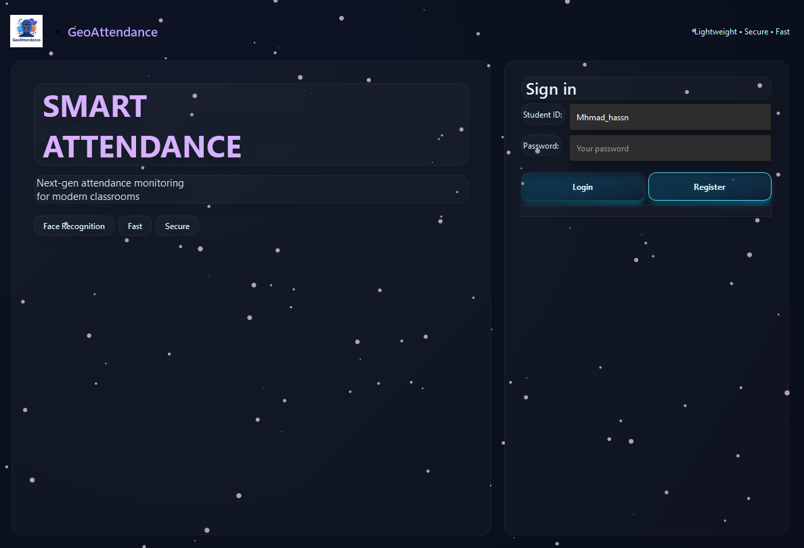
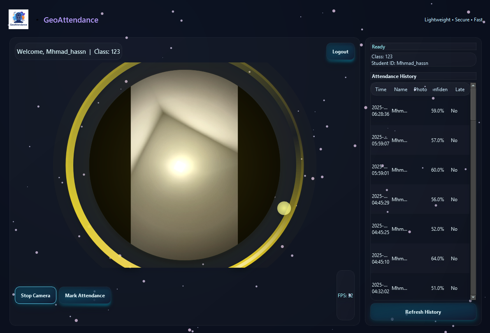
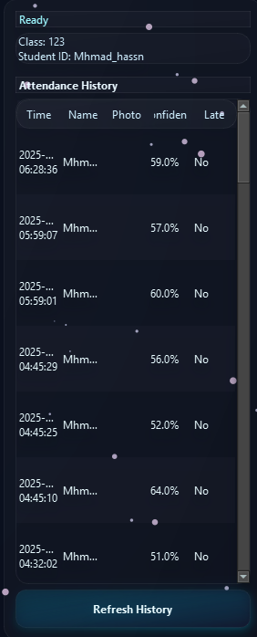

markdown
## 🌌 GeoAttendance — Smart Face-Based Attendance System

[](https://www.python.org/)


> A futuristic, space-themed desktop attendance system that uses face recognition and liveness detection to mark student attendance — secure, fast, and beautiful.


---

## 🚀 Features

- ✅ Real-time face recognition with confidence scoring  
- ✅ Liveness detection to prevent photo/video spoofing  
- ✅ Modern PySide6 UI with animated electric rings, starfield background, and glass effects  
- ✅ Local SQLite database storing attendance history and snapshots  
- ✅ Simple student login (admin-free design)  
- ✅ Cross-platform: Windows, macOS, Linux

---

## 🖼️ Demo / Screenshots

Login screen  


Main dashboard  


Attendance history  


---

## 📦 Requirements

- Python 3.8 or newer  
- A working webcam

Install dependencies:
```bash
pip install -r requirements.txt
```

---

## 🛠️ Quick Start

1. Clone the repository:
```bash
git clone https://github.com/yourname/GeoAttendance.git
cd GeoAttendance
```

2. (Recommended) Create and activate a virtual environment:
```bash
python -m venv .venv
# macOS / Linux
source .venv/bin/activate
# Windows
.venv\Scripts\activate
```

3. Install dependencies:
```bash
pip install -r requirements.txt
```

4. Add your face images:
- Place one clear `.jpg` per person in `known_faces_data/` (use a readable filename like `Mhmad_Hassn.jpg`).

5. Encode faces (generates face encodings used by the app):
```bash
python encode_faces.py
```

6. Run the app:
```bash
python gui_pyside6_final.py
```

---

## 🎯 How It Works

1. Register a student account (ID, password, name, class).  
2. Log in with your ID and password.  
3. Start the camera and present your face.  
4. If recognition confidence ≥ 65%, attendance is recorded (photo + timestamp).  
5. View your attendance history in the Dashboard.

Notes:
- The UI ring turns green on success and red on failure.
- For best results use frontal, well-lit photos.

---

## 🧩 Project Structure

```
GeoAttendance/
├── banner.png
├── screenshots/            ← optional images for README
├── known_faces_data/       ← one .jpg per person
├── models/                 ← encodings.pkl (generated)
├── database/               ← SQLite files
├── attendance_photos/      ← snapshots of attendance events
├── gui_pyside6_final.py    ← main GUI app
├── encode_faces.py         ← generate encodings
├── run_recognition.py      ← optional test script
├── requirements.txt
├── .gitignore
└── README.md
```

---

## 📦 Packaging (Optional)

Create a standalone Windows executable:
```bash
pip install pyinstaller
pyinstaller --onefile --windowed gui_pyside6_final.py
```

For macOS or Linux, consider pyinstaller or platform-specific bundlers.

---

## 💡 Tips for Best Accuracy

- Use high-quality, well-lit, frontal face photos.  
- Avoid extreme angles, heavy makeup, or occlusions (hats, large sunglasses).  
- Re-run `python encode_faces.py` after adding or changing images in `known_faces_data/`.

---

## 🤝 Contributing

Contributions, bug reports, and feature requests are welcome.

Suggested workflow:
1. Fork the repository  
2. Create a branch (e.g., `feature/add-liveness-modes`)  
3. Commit changes and open a Pull Request with a clear description and testing notes

Please include tests or manual verification steps for UI/recognition changes.

---

## 🆘 Support

Found a bug or want a feature? Open an issue in the repository or contact me at <your-email-or-handle>.

---

## 📜 License

This project is released under the MIT License. See the LICENSE file for details.

---

© 2025 GeoAttendance — Made with ❤️ for modern classrooms.
```
